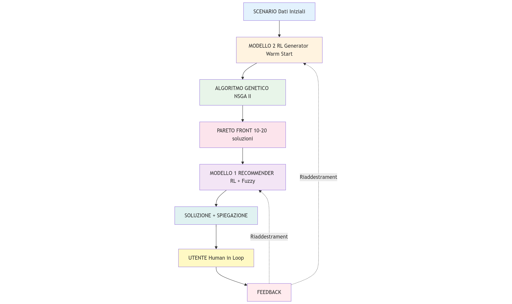

<!-- _class: lead -->
# Sistema Intelligente di Raccomandazione Percorsi con Explainability
## Approccio Ibrido: Algoritmi Genetici + Fuzzy Logic + Reinforcement Learning
---
# 📋 Agenda
1. Problema e Obiettivi
2. Architettura del Sistema
3. Componente 1: Algoritmo Genetico
4. Componente 2: Sistema Fuzzy
5. Componente 3: Modello RL - Recommender
6. Componente 4: Modello RL - Generator
7. Human-in-the-Loop Learning
8. Pipeline Completa
9. Vantaggi dell'Approccio
10. Risultati Attesi e Metriche

---
# 1️⃣ Problema
### **Contesto**
Pianificazione di percorsi in ambiente 40×40 con vincoli multipli
### **Obiettivi Contrastanti**
- ✅ Minimizzare lunghezza percorso
- ✅ Minimizzare distanza dall'uscita
- ✅ Ottimizzare direzione verso uscita
### **Challenge**
Come bilanciare questi obiettivi e **spiegare** la scelta?

---
# 1️⃣ Obiettivi del Sistema
1. 🎯 **Generare** percorsi ottimi (Pareto front)
2. 🤖 **Raccomandare** soluzione migliore
3. 💡 **Spiegare** perché è la migliore
4. 📚 **Apprendere** da feedback umano
5. ⚡ **Accelerare** convergenza genetico
**Innovazione**: Combinare GA + Fuzzy + RL con explainability

---
# 2️⃣ Architettura del Sistema

                              ┌─────────────────────────────────────────────────┐
                              │         ARCHITETTURA COMPLETA                   │
                              └─────────────────────────────────────────────────┘

                                    SCENARIO (Dati Iniziali)
                                                 ↓
                                          ┌─────────────────────┐
                                          │  MODELLO 2          │
                                          │  RL Generator       │  ← Genera popolazione
                                          │  (Warm-Start)       │     iniziale intelligente
                                          └─────────────────────┘
                                                ↓
                                          ┌─────────────────────┐
                                          │  ALGORITMO          │
                                          │  GENETICO           │  ← Ottimizzazione
                                          │  (NSGA-II)          │     multi-obiettivo
                                          └─────────────────────┘
                                                ↓
                                          PARETO FRONT (10-20 soluzioni)

---
# 2️⃣ Architettura continua

                                                            PARETO FRONT
                                                                  ↓
                                                      ┌───────────────────────────────────────┐
                                                      │  MODELLO 1: RECOMMENDER               │
                                                      │  ┌─────────────┐  ┌────────────────┐  │
                                                      │  │  RL Model   │  │ Fuzzy System   │  │
                                                      │  │  (Decisione)│  │ (Spiegazione)  │  │
                                                      │  └─────────────┘  └────────────────┘  │
                                                      └───────────────────────────────────────┘
                                                                    ↓
                                                             SOLUZIONE + SPIEGAZIONE
                                                                     ↓
                                                            ┌─────────────────────┐
                                                            │  UTENTE             │  ← Valida/Corregge
                                                            │  (Human-in-Loop)    │
                                                            └─────────────────────┘
                                                                     ↓
                                                            FEEDBACK → Riaddestramento

---

# 2️⃣ Architettura del Sistema
  

---
# 3️⃣ Algoritmo Genetico

### **Input**
- Scenario area punti ingresso uscita
- Popolazione iniziale 50% ML + 50% casuale
### **Processo**
- Evoluzione con NSGA-II
- Selezione crossover mutazione
- Ottimizzazione multi-obiettivo
### **Output**
- Pareto Front: 10-20 soluzioni non dominate
- Genotipi: waypoints x y velocità
---

# 3️⃣ Fitness del Genetico
### **Obiettivi**
1. Path Length ∈ ]0, 113] m Lunghezza spezzata in area 40×40
2. Exit Distance ∈ [0, 160] Distanza sul perimetro
3. Exit Direction ∈ [0°, 360°[ Angolo verso uscita
### ⚠️ **Problema**
Convergenza lenta con popolazione casuale 100+ generazioni

---
# 4️⃣ Sistema Fuzzy - Ruolo Duplice
### **A Esperto per Training**
Genera preferenze ground truth per addestrare RL
### **B Layer di Explainability**
Spiega perché una soluzione è raccomandata
### **Perché Fuzzy?**
✅ Interpretabile regole linguistiche
✅ Esprime preferenze umane
✅ Non richiede dati iniziali
✅ Trasparente e verificabile

---
# 4️⃣ Architettura Fuzzy
### **INPUT** 3 variabili linguistiche
- Path Length: corto medio lungo
- Exit Distance: vicino medio lontano
- Exit Direction: allineato parziale perpendicolare opposto
### **REGOLE** 27 IF-THEN
IF path corto AND distance vicino AND direction allineato THEN preferenza molto alta
### **OUTPUT**
- Preferenza: Score 0-100

---
# 4️⃣ Esempio Fuzzy
**Input**: Path Length 70m Exit Distance 40 Exit Direction 45°
**Fuzzificazione**: 
- 60% corto 40% medio 
- 80% vicino 20% medio 
- 70% allineato 30% parziale

**Output**: Preferenza 85 su 100 ✅
**Spiegazione**: Soluzione OTTIMA percorso CORTO uscita VICINA direzione ALLINEATA

---
# 5️⃣ Modello 1: RL Recommender

### **Funzione**
Seleziona migliore soluzione dal Pareto front
### **Architettura**
- Algoritmo: PPO Stable-Baselines3
- Network: MLP 256 256
- Input: Scenario + Statistiche Pareto 15 dim
- Output: Indice soluzione 0-99
### **Training**
- Teacher: Sistema Fuzzy
- Dataset: 200-500 Pareto front
- Reward: +10 se match fuzzy negativo altrimenti
- Target: Accuracy > 80%

  
---
# 5️⃣ Vantaggi RL vs Solo Fuzzy

|Aspetto|Solo Fuzzy|RL Recommender|
|:---------|:------:|-------:|
|Velocità|Lento|Veloce|
|Generalizzazione | Rigido |Adattativo|
|Pattern Complessi | Limitato|Impara|  
| Interpretabilità|Alta|Black box |
| Feedback |Manuale|Auto learning|

**Soluzione**: Combinare entrambi 🎯

---
# 6️⃣ Modello 2: RL Generator

### **Funzione**
Genera popolazione iniziale intelligente warm-start
### **Architettura**
- Algoritmo: SAC azioni continue
- Network: MLP 256 256
- Input: Solo scenario 6 dim
- Output: Genotipo completo 30 valori
### **Training**
- Target: Genotipi scelti da fuzzy umano
- Reward: Similarità con target
- Dataset: 300-500 coppie scenario genotipo

---
# 6️⃣ Warm-Start del Genetico

### **Popolazione Mista** 100 individui
50% da RL Generator: Primo deterministico migliore Altri 49 con rumore diversità
50% Casuali: Garantiscono esplorazione
### **Risultato**
✅ Convergenza 2-3× più rapida
✅ Pareto front più ricco
✅ Meno computazione

---
# 7️⃣ Human-in-the-Loop

### **Ciclo di Apprendimento**
1. Sistema raccomanda + spiega fuzzy
2. Utente valida o corregge Accordo Rinforza Disaccordo Analizza
3. Accumula feedback
4. Ogni 50-100 feedback Identifica pattern Suggerisce update fuzzy Riaddestra modelli
5. Sistema migliorato

---
# 7️⃣ Analisi Disaccordi
### **Quando utente sceglie diverso**
**Confronto Quantitativo**
- Differenze nei 3 obiettivi
- Confronto preferenze fuzzy

**Pattern Detection** su 10+ casi
- Medie sistema vs umano 
- Identificazione bias

**Suggerimenti Automatici**
Esempio: Utente tollera percorsi +15% più lunghi → Allarga membership medio path length

---
# 8️⃣ Pipeline Completa - Esempio
### **Scenario**: Area 40×40 ingresso -20 -20 uscita 15 20
**Step 1:** Modello 2 → 50 genotipi intelligenti
**Step 2:** Genetico → 50 gen invece 100 → 15 soluzioni Pareto
**Step 3:** Modello 1 + Fuzzy → Soluzione 3 Score 92 su 100
**Step 4:** Presentazione Utente RACCOMANDAZIONE
- Path 65m CORTO 
- Distance 35 VICINO 
- Direction 25° ALLINEATO 
- Alternative: 14 soluzioni

**Step 5:** Utente o accetta → Feedback registrato

---
# 8️⃣ Gestione Feedback
### **Se Utente Accetta** ✓
- Feedback positivo 
- Modelli confermati 
- Continua con prossimo scenario
### **Se Sceglie Alternativa** ✗
**Analisi:**
-  Raccomandata PL 65 ED 35 DIR 25° Pref 92 
- Scelta: PL 80 ED 20 DIR 30° con Pref 88

**Pattern Identificato:** Preferisce uscita più vicina anche con percorso più lungo
**Azione:** Accumula per riaddestramento

---
# 9️⃣ Vantaggi dell Approccio

### **Performance**
✅ Convergenza 2-3× più rapida
✅ Accuracy >80% arriva a 90%+ con HITL
✅ Qualità Pareto superiore
### **Explainability**
✅ Spiegazioni comprensibili
✅ Visualizzazioni grafiche
✅ Trasparenza decisionale

### **Adattabilità**
✅ Apprendimento continuo
✅ Auto-correzione
✅ Identificazione bias

---
# 9️⃣ Vantaggi continua

### **Robustezza**
✅ Fuzzy come baseline
✅ RL generalizza
✅ HITL corregge errori
### **Versatilità**
✅ Bootstrap senza dati umani
✅ Integrazione graduale feedback
✅ Funziona con senza utente

### **Fiducia**
✅ Spiegazioni Trust
✅ Utente comprende criteri
✅ Possibilità di correggere

---
# 🔟 Metriche e Risultati
|Metrica| Target|Baseline|Nostro Sistema|
|:---------|:------:|:------:|-------:|
| Accuracy | >80% |-| 85% a 92% HITL|
| Gen Genetico | <50 | 100+ | 50|
| Qualità Pareto HV|  +20% | 0.65 | 0.78|
| Agreement | >85% |-| 85-95%|
| Tempo Target |-30% | 100% | 70%|
| Explainable Target| Sì | No | Sì|

---
# 🔟 Evoluzione nel Tempo
**Fase 1: 0-100 scenari Bootstrap**
 Accuracy 60-70% Training Solo fuzzy
**Fase 2: 100-300 scenari Learning**
 Accuracy 70-80% Training 80% fuzzy 20% umano
**Fase 3: 300-500 scenari Maturità**
 Accuracy 80-90% Training 20% fuzzy 80% umano
**Fase 4: 500+ scenari Esperto**
 Accuracy >90% Training Principalmente umano

---
# 🎯 Contributi Principali
### **1 Architettura Innovativa**
Combinazione GA Fuzzy RL mai esplorata prima
### **2 Explainability**
Fuzzy come layer interpretativo per RL
### **3 Warm-start Intelligente**
RL per inizializzare genetico approccio novel
### **4 HITL con Auto-miglioramento**
Sistema che corregge se stesso

---
# 🚀 Applicazioni
### **Domini**
- Pianificazione percorsi robotici
- Navigazione autonoma
- Decision support systems
- Problemi multi-obiettivo complessi
### **Caratteristiche Chiave**
- Richiede explainability
- Preferenze difficili da formalizzare
- Necessità di adattamento
- Utenti non esperti di AI

---
# 🚀 Implementazione

### **Stack Tecnologico**
- Stable-Baselines3: PPO SAC
- scikit-fuzzy: Sistema fuzzy
- Gymnasium: Environment RL
- NumPy Matplotlib: Elaborazione
### **Dataset**
- Training: 200-500 Pareto front
- Test: 100-150 scenari
- Feedback: 200+ interazioni
### **Risorse**
- Training: 6-10 ore CPU
- Inference: <1 secondo

---
# 📈 Roadmap

### **Fase Attuale** ✅
1. Sistema fuzzy completo
2. Training Modello 1 in corso
### **Prossimi Passi** ⏳
3. Training Modello 2
4. Integrazione HITL
5. Valutazione 300+ scenari
### **Futuro** 🔮
- Estensione a 3D
- Integrazione robotica
- Transfer learning
- Benchmark pubblici

---
# 🎓 Conclusioni

### **Sintesi**
Sistema che combina performance RL interpretabilità Fuzzy adattabilità HITL
### **Vantaggi Unici**
- 50% tempo computazione
- >90% accuracy con feedback
- Completamente spiegabile
- Auto-migliorante
### **Impatto**
Rende AI utilizzabile in settori critici dove explainability è essenziale

---
<!-- _class: lead -->
# Grazie!
## Domande?
📧 salvatore@example.com
🔗 github.com/yourrepo
